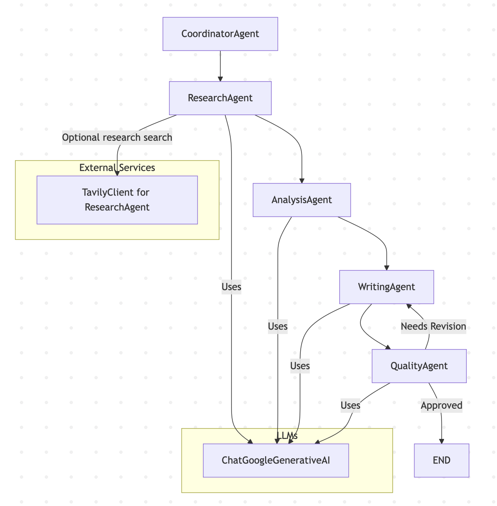

# Diagnosys
Multi-Agent Orchestration for Content Intelligence

## Project Overview
Diagnosys is a framework designed for orchestrating multiple intelligent agents to perform sophisticated content analysis and intelligence tasks. It provides a robust multi-agent pipeline capable of processing, analyzing, and extracting valuable insights from diverse content types. The system aims to streamline complex content workflows by breaking them down into manageable tasks handled by specialized agents, enhancing both efficiency and accuracy.

## Features
- **Multi-Agent Orchestration**: Seamlessly integrate and manage multiple AI agents for complex tasks.
- **Content Analysis**: Advanced capabilities for processing and understanding diverse content types.
- **Extensible Architecture**: Easily add new agents and functionalities to the framework.

## Architecture
Diagnosys employs a high-level system design that facilitates modularity and scalability. The core architecture revolves around a central orchestrator that manages the flow of information and tasks between various specialized agents.



## Setup Instructions

To get started with Diagnosys, follow these step-by-step installation and configuration instructions:

1. **Clone the repository**:
   First, clone the Diagnosys repository from GitHub to your local machine:
   ```bash
   git clone https://github.com/hasalams/diagnosys.git
   cd diagnosys
   ```

2. **Set up the environment**:
   It is highly recommended to use a Python virtual environment to manage dependencies. This ensures that project dependencies do not conflict with other Python projects on your system.
   ```bash
   python -m venv venv
   source venv/bin/activate  # On Windows, use `venv\Scripts\activate`
   ```

3. **Install dependencies**:
   Once your virtual environment is active, install all required Python packages using pip:
   ```bash
   pip install -r requirements.txt
   ```

## Usage Examples

To run the backend and frontend services, use the provided shell scripts. These scripts simplify the process of getting the system up and running.

1. **Environment Configuration**:

   Create a `.env` file based on `.env_template` and add the required API keys:

   ```
   cp .env_template .env
   ```
   Then edit `.env` to fill in your API keys:

   ```
   TAVILY_API_KEY="<your-tavily-api-key>"
   GOOGLE_API_KEY="<your-google-api-key>"
   ```
   **Note:** Currently, only Google Gemini models are supported due to their ease of access and large context window.


2. **Start the backend**:
   Open your terminal and execute the backend startup script:
   ```bash
   ./start_backend.sh
   ```
   This will start the backend FastAPI server, which handles agent orchestration and data processing.

3. **Start the frontend**:
   Open another terminal window, activate your virtual environment (as described in step 2 of Setup Instructions), and then execute the frontend startup script:
   ```bash
   ./start_frontend.sh
   ```
   This will launch the Streamlit web interface for Diagnosys, allowing you to interact with the system.

For practical examples on how to use the multi-agent pipeline with sample inputs, refer to the `examples/` directory. Specifically, `examples/run_pipeline.py` demonstrates how to configure and execute a content intelligence pipeline.

## Agent Descriptions

Diagnosys leverages a variety of specialized agents, each designed to perform a distinct task within the content intelligence pipeline. These agents interact with the orchestrator to receive tasks and deliver results.

**CoordinatorAgent:** Orchestrates the workflow by managing the sequence of agents. It initializes the pipeline, monitors progress, and ensures each agent executes in the correct order.

**ResearchAgent:** Responsible for gathering relevant information and data for a given request. It uses both LLM-based topic extraction and Tavily search results (or simulated data) to compile research data including key topics, sources, findings, study counts, and confidence levels.

**AnalysisAgent:** Synthesizes and analyzes the research data collected. It identifies key themes, performs statistical analysis, assesses evidence quality, and highlights limitations and biases. Generates recommendations based on the findings.

**WritingAgent:** Creates comprehensive, professional content based on the research and analysis. Produces a structured report with an executive summary, methods, results, discussion, conclusions, and references. Formats content with metadata such as request, date, study count, and evidence quality.

**QualityAgent:** Reviews the draft content for accuracy, logical consistency, statistical interpretation, and completeness. Provides structured feedback, assigns an overall score, and approves or requests revisions. Finalizes the content upon approval.

## Framework Justification

Diagnosys is built on a multi-agent orchestration framework using LangGraph for several key reasons:

**Explicit Workflow Management:** LangGraph allows the pipeline to be defined as a state graph, making transitions between agents clear, explicit, and traceable. This reduces ambiguity in complex multi-agent workflows.

**Asynchronous and Conditional Execution:** LangGraph natively supports asynchronous execution and conditional branching. This enables agents to run in parallel where appropriate, handle approval/revision loops, and respond dynamically to feedback without hard-coding workflow logic.

**Modularity and Extensibility:** Each agent operates as a self-contained node in the graph. Adding new agents or modifying existing ones is straightforward, without impacting the rest of the workflow.

**Resilience and Error Handling:** LangGraph provides structured ways to handle failures, retries, and alternative paths, improving robustness in multi-agent pipelines.

**Observability and Traceability:** Using a graph-based orchestrator allows Diagnosys to maintain a detailed execution history, logging agent actions, metadata, and transitions. This is critical for auditing, debugging, and performance monitoring.

**Declarative Pipeline Definition:** Instead of procedural code, workflows are defined declaratively via nodes and edges. This improves readability, maintainability, and facilitates future enhancements, such as visualization or UI-based pipeline builders.

By leveraging LangGraph, Diagnosys achieves a balance between flexibility, maintainability, and robust orchestration, making it easier to manage sophisticated multi-agent content intelligence workflows.


## Performance Considerations

To ensure Diagnosys remains scalable, responsive, and efficient under varying workloads, several performance strategies have been implemented, taking advantage of LangGraph’s capabilities:

**Asynchronous Agent Execution:** Agents communicate asynchronously through the orchestrator, enabling concurrent processing of independent tasks. This prevents bottlenecks and maximizes resource utilization.

**Conditional and Parallel Workflow Paths:** LangGraph supports conditional branching and parallel execution, allowing the pipeline to dynamically skip, repeat, or parallelize tasks based on agent feedback or workflow conditions.

**Load Distribution:** Individual agents can be scaled independently. If certain tasks become computationally heavy (e.g., LLM calls or Tavily searches), multiple instances of the same agent can be run concurrently to distribute the load.

**Caching and Result Reuse:** Intermediate outputs, such as research results or analysis summaries, can be cached to avoid redundant computations and reduce API calls, improving overall throughput.

**Resilient Error Handling:** LangGraph’s state management allows agents to fail gracefully without crashing the entire pipeline. Errors are logged, and fallback paths or retries can be executed automatically.

**Traceability for Optimization:** The graph-based orchestration provides detailed metadata on agent execution times, success rates, and workflow transitions, allowing identification of performance bottlenecks for optimization.

By combining asynchronous execution, scalable agent design, and LangGraph’s robust workflow management, Diagnosys maintains high performance while supporting complex multi-agent content intelligence operations.

## Future Enhancements

While Diagnosys already provides a REST API via FastAPI and a web interface through Streamlit, several enhancements could further strengthen the platform:

**Docker Support:** Provide official Docker images for the backend and frontend, enabling consistent and portable deployments across different environments.

**Cloud Integration:** Enable deployment on cloud platforms such as AWS, Azure, or GCP. This could include managed hosting, scalable storage, and serverless execution for agent workflows.

**Advanced Orchestration Features:** Extend LangGraph workflows to include more sophisticated logic such as conditional branching, parallel execution of independent agents, retry policies for failed steps, and timeouts for long-running tasks.

**Metrics and Monitoring Dashboard:** Implement a visual dashboard for monitoring agent performance, workflow progress, and system health. Integration with tools like Arize or Prometheus could provide real-time analytics and alerting.

**Enhanced User Interface:** Improve the frontend to include interactive workflow builders, real-time visualization of agent execution, and options to configure agent parameters dynamically.

**Security Enhancements:** Implement authentication, authorization, and data encryption for both API and UI layers to ensure secure access and compliance with privacy standards.

**Performance Optimization:** Introduce caching for frequently requested research data, GPU acceleration for LLM calls, and dynamic scaling of agent instances to handle high loads efficiently.

These enhancements would make Diagnosys more robust, user-friendly, and production-ready, while leveraging its modular multi-agent architecture for advanced content intelligence workflows.

## Project Structure

- `src/`: Contains the core source code for the multi-agent framework.
  - `app.py`: Main application entry point.
  - `backend.py`: Backend service implementation.
  - `pipeline.py`: Core pipeline definition and execution.
- `examples/`: Demonstrative scripts for using Diagnosys.
  - `run_pipeline.py`: Example script to run a content intelligence pipeline.
  - `Diagnosys_Content_Intelligence_System_Report.pdf`: Sample report from the web interface.
- `docs/`: Contains architecture diagram.
- `start_backend.sh`: Script to start the FastAPI backend service.
- `start_frontend.sh`: Script to start the Streamlit frontend service.
- `README.md`: Project documentation.
